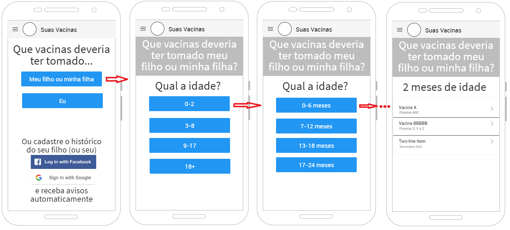

# Vacine.org

[](https://circleci.com/gh/suasvacinas/suasvacinas)

App de [Vacine.org](https://vacine.org).

---

# Breve descrição do público alvo e do problema a ser resolvido
Nosso público são pais e mães de crianças interessados em obter informações consistentes sobre imunização, ampliar os benefício na vacinação de seus filhos, ter uma forma eficiente de controle das doses tomadas e das próximas vacinas a serem aplicadas. 

O problema a ser resolvido é o controle de vacinação de crianças disponibilizando indicações da rede pública (SUS - Sistema Único de Saúde) e da rede privada (SBim - Sociedade Brasileira de Imunizações e SBP - Sociedade Brasileira de Pediatria).

# Breve descrição da solução concebida
A solução permite a visualização de informações gerais sobre imunização na rede pública como também formas de ampliar a cobertura fornecida pelo SUS. Quando logado ao sistema é possível a criação de diversas cadernetas de vacinação incluindo o nome da pessoa, a data de nascimento, o sexo, as vacinas que já tomou, assim como a data da imunização. As informações não são de preenchimento obrigatório. 
Ao finalizar o cadastro o sistema gera a informação de quantas vacinas já foram tomadas, se há doses em atraso ou se existem vacinas a serem tomadas nos próximos 3 meses, de acordo com a faixa etária da pessoa cadastrada. 

# Descrição resumida da estratégia utilizada para promoção de engajamento
Durante o desenvolvimento da solução a ser concebida entramos em contato com mães de crianças para conversar e verificar as dificuldades enfrentadas a cerca do assunto imunizações. Nesse período também foram pesquisados grupos do facebook que tivessem relacionamento com o tema para divulgar a solução. 
Quando a solução teve condições mínimas de ser disponíbilizada, foi iniciada a divulgação da mesma, tanto em grupos de whatsapp como de facebook, solicitando aos interessados sugestões e críticas para melhoria da solução, assim como apoio para divulgação da mesma.


# Instruções/Histórico

Ambiente inicial (outros podem funcionar, apenas este foi o que usamos inicialmente):

- **Node v8.1.0** e **NPM 5.0.3**
  - Deve funcionar em Node 6.x e NPM 4.x.
- **Ionic Framework** e **para interagir com o firebase**
  - `npm i -g ionic cordova firebase-tools`


#### Como rodar o projeto:

```shell
# Subir o servidor/app
# Visite http://127.0.0.1:8100
ionic serve

# Testes unitarios
npm test

# Testes e2e
# Ligue a app:
ionic serve
# Enquanto a app estiver rodando:
npm run e2e
```

## Protótipo primeira versão



# Outros

Adicionei os arquivos de testes de unidade e e2e vide http://blog.ionic.io/basic-unit-testing-in-ionic/
 e https://github.com/driftyco/ionic-unit-testing-example.
Também foram feitas as adaptacoes necessarias, porque o CLI ionic ainda nao cria testes por padrao.
